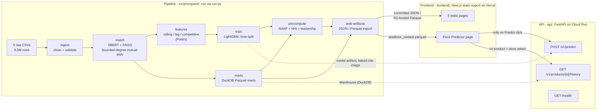
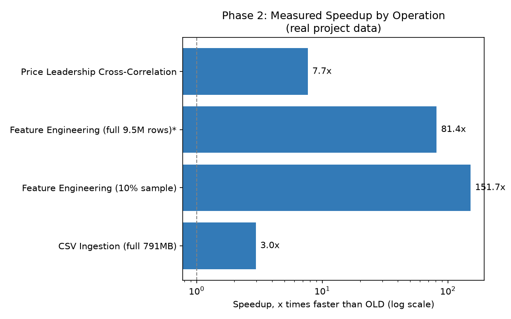
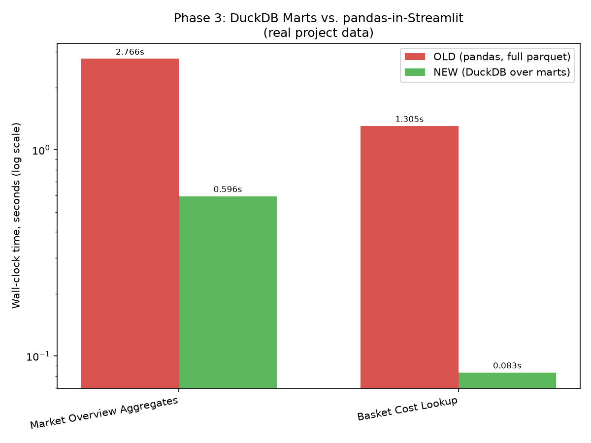

# PricePoint Dynamics

[](https://www.python.org/downloads/)
[](https://github.com/BhargavKumarNath/PricepointDynamics/actions)
[](https://opensource.org/licenses/MIT)
[](https://fastapi.tiangolo.com/)
[](https://nextjs.org/)
[](https://lightgbm.readthedocs.io/)
[](https://duckdb.org/)
[](https://pola.rs/)

**Live dashboard:** [pricepoint-dynamics.vercel.app](https://pricepoint-dynamics.vercel.app/)
**API:** `pricepoint-api-520172985323.europe-west2.run.app` (`/health`, `/docs`)

---

## Project Overview

Tesco, Sainsbury's, ASDA, Morrisons and Aldi all reprice against each other constantly. If you actually want to see that in data, though, the first problem you hit isn't statistics, it's naming. "Tesco Finest British Beef Mince 5% Fat 500g" and "ASDA Extra Special British Beef Steak Mince 5% Fat" are the same category of product, and nothing in a raw scrape tells you that. Until you solve that, you don't have a dataset - you have five unrelated retailers' worth of noise.

This project takes 9.5 million scraped daily price rows from those five retailers, resolves them into one canonical product catalogue, and builds on top of that catalogue: a price forecasting model, an explainability layer, and a set of market-structure analytics (who's cheapest, who moves first, how concentrated is each category). It's served through a small FastAPI backend and a dashboard that loads instantly for anyone visiting it, because five of its six pages don't touch the backend at all.

It started as a set of exploratory notebooks and a Streamlit app I put together to answer these questions for myself. What's here now is the result of going back and rebuilding the parts of that prototype that didn't actually hold up - described in the next section - into something I'd be comfortable calling production-shaped.

---

## Legacy System Assessment

The core analysis code (`pricepoint/`) was already reasonable - typed, documented, with real Pandera validation on the raw data and some genuine memory-usage fixes from earlier OOM crashes. The problem was everything wrapped around it. Going through it line by line turned up a fairly long list of things that either didn't work as advertised or would quietly produce wrong answers:

- Two of the three data-validation schemas (`CANONICAL_PRODUCTS_SCHEMA`, `FEATURE_DATA_SCHEMA`) were written but never actually called. So the two most complicated stages of the pipeline - product matching and feature engineering - had zero validation. A schema drift there would have passed silently.
- The dashboard loaded `canonical_products_lite.parquet` and `feature_data_lite.parquet` - files that no script in the repository produced. Someone had generated them by hand at some point, uploaded them to Google Drive, and that step was never written down anywhere. A fresh clone of the repo could not reproduce what the dashboard was actually reading.
- The price predictor page was the worst offender. It was supposed to be the interactive centerpiece, but it fabricated most of its own model inputs: `price_rol_min_7d = price_rol_mean_7d * 0.9` is a made-up constant, not a real feature value, and roughly 30 of the model's ~40 inputs were just zero-filled. The "prediction" you saw on that page had very little to do with the actual data.
- Headline stats on the dashboard ("£0.14", "9.5 Million", "67,000+") were hardcoded strings, not computed from anything. They'd drift the moment the model was retrained and nobody would notice.
- The feature-engineering rolling/lag statistics were computed with `groupby(...).transform(lambda x: x.rolling(...))`, run separately for mean, std, max, and min across three window sizes - a dozen-plus full Python-level passes over 9.5 million rows. This was the single slowest part of the whole pipeline by a wide margin.
- The price-leadership cross-correlation logic was a triple-nested Python loop calling `.corr()` once per retailer pair per lag. Slow, and it didn't need to be.
- There was no lockfile, no installable package, and two `requirements.txt` files that had already drifted apart on the numpy version they pinned.

None of this needed a rewrite. It needed someone to go through it and actually close each gap, which is what I spent most of this project doing.

---

## System Architecture



Raw CSVs go through cleaning and validation, then product matching (the semantic name-resolution step), then feature engineering, then training. Separately, the resolved product catalogue also feeds a set of DuckDB analytics marts, which get queried both by the dashboard's precomputed pages and by the one API endpoint that needs live history data. Everything the frontend needs that *doesn't* require live compute gets exported once, as JSON or Parquet, and committed or uploaded - the frontend just reads files.

That last point shapes the whole deployment. Out of the six dashboard pages, only the price predictor's "Predict" button does something that genuinely can't be precomputed - an arbitrary user-picked product, store, date, and optional "what if the price were X" override. Everything else - market overview, basket costs, SHAP explanations, market-structure metrics - is a fixed answer computed once by the pipeline. So five pages load instantly with real numbers already in them, and only one page ever talks to a live backend, and only when you actually click something. I went through each page explicitly to check this before committing to it (it's written up as [ADR-0005](docs/adr/0005-static-first-zero-wait-frontend.md) if you want the full reasoning), because it's the decision that determines whether someone opening this project for the first time sees a working dashboard or a loading spinner over a sleeping Cloud Run instance.

---

## Engineering Deep Dives

### Semantic Product Resolution: Fixing a Clustering-Chaining Failure

Matching ~114,000 unique retailer product names down to a canonical set sounds like a straightforward embedding-similarity problem, and my first working version treated it that way: encode every name with Sentence-BERT, and connect any two names whose cosine similarity crossed a threshold, then take connected components as clusters.

At a 0.85 threshold, 96% of every product name in the dataset ended up in a single cluster. Raising the threshold to 0.90 still left the majority of the corpus in one giant blob. What was happening is a known failure mode of this kind of clustering - chaining, through generic short phrases. Something like "0 fat greek style" is similar enough to dozens of genuinely unrelated products that it acts as a hub, and once a hub connects to two otherwise-unrelated clusters, they merge into one. It gets worse as the corpus grows, not better, so a threshold that looks fine on a small sample can still fail badly at full scale - which is exactly what happened here.

The fix was to stop using plain similarity thresholding and require mutual nearest-neighbour edges instead: name A only connects to name B if each is genuinely among the other's top-5 nearest neighbours. That bounds how many other names any single hub phrase can ever pull in, while still correctly resolving real multi-hop matches (A matches B, B matches C, so A and C end up in the same cluster even if they're not each other's nearest neighbours directly). With `threshold=0.95` and `mutual_k=5`, this recovers 68,596 canonical products - close to the number I'd expect from this dataset - instead of one degenerate supercluster. There's a regression test in `tests/test_product_matching.py` built specifically around this hub-chaining scenario, not just a happy-path clustering check, because this is exactly the kind of bug that looks fine until it silently isn't.

### Feature Engineering: Eliminating Target Leakage

One of the model's features is meant to capture "how does this product's price compare to the same-day market average across retailers." The obvious way to compute that - group by product and date, take the mean price - has a subtle problem: the row's own price is part of that mean. So the model was, in effect, being handed a feature that was partly derived from the exact value it was trying to predict. It's a soft form of leakage rather than a blatant one, which is exactly what makes it easy to miss.

The fix is to compute that market average leave-one-out: exclude a row's own price before averaging the rest. Same idea applies to `prices_unit`, a per-unit rescaling of the row's own price (essentially £/kg) that I found was near-constant within about 82% of product groups - close enough to the target that including it as a feature would have been almost the same as leaking the answer directly. Both are excluded now, and both have a named ADR ([0006](docs/adr/0006-no-target-leakage-leave-one-out.md), [0018](docs/adr/0018-exclude-same-row-derived-features.md)) explaining why, because "obviously don't leak the target" is easy to say and surprisingly easy to get subtly wrong in practice.

### Train/Serve Consistency

The old dashboard's predictor fabricated most of its inputs, as mentioned above. The structural fix isn't "be more careful filling in values" - it's to make sure there's only one function that builds a feature vector, used both at training time and at prediction time. `training.py::build_feature_vector` is that function; the API calls it directly rather than reimplementing the same logic. I checked this by comparing the API's output against a direct `model.predict()` call on the same identically-resolved data, byte for byte. It's a small design choice, but it's the one that makes the old bug structurally impossible to reintroduce, rather than just less likely.

### Performance Optimization

Two things were genuinely slow: the rolling/lag feature computation and the price-leadership correlation. Both were doing per-group Python-level work - a `groupby().transform(lambda ...)` in the first case, a nested loop calling `pandas.Series.corr()` in the second - and both got rewritten to push the actual computation down into vectorized code (Polars `.over()` expressions for the first, vectorized NumPy for the second). The numbers are in the [Results](#results) section below with the actual benchmark plots, but the short version is that the feature-engineering rewrite was worth well over 100x on a representative sample, which is the kind of number that only shows up when the original approach genuinely wasn't doing any vectorized work at all.

---

## Data Warehouse & SQL Layer

Analytics run on DuckDB, embedded directly against Parquet files - no server, no connection pool, nothing to provision. I went back and forth on this because "just use Postgres" is the reflexive answer, but there's no actual case for it here: every query this project runs is a read-only aggregation over data that only changes when the pipeline reruns. There's no concurrent writer to coordinate with, so a transactional database would be solving a problem that doesn't exist in this project ([ADR-0001](docs/adr/0001-duckdb-not-postgres.md)).

The main mart, `fact_price_daily`, is one row per (product, retailer, date):

```sql
SELECT
    canonical_name, supermarket, date,
    AVG(prices) AS avg_price, MIN(prices) AS min_price,
    MAX(prices) AS max_price, COUNT(*) AS n_listings
FROM read_parquet(?)
GROUP BY canonical_name, supermarket, date;
```

The `AVG()` isn't a stylistic choice. When I checked, 41.5% of rows in the resolved dataset - 3.96 million of 9.53 million - turn out to be duplicates at exactly this grain, because product matching legitimately clusters different pack sizes of the same product (a 500g and a 1kg version of the same thing) into one canonical name. The old Streamlit dashboard handled this with `drop_duplicates(keep="first")`, which just throws away all but one arbitrary observation. Averaging is the more honest resolution, and it's also more useful - a consumer that actually needs the spread still has `MIN`/`MAX`/`n_listings` sitting right there instead of having to reconstruct it from raw data.

`dim_product` has a smaller version of the same problem: about 20% of canonical products have more than one distinct category label across the rows that got merged into them, and roughly 1% have inconsistent own-brand flags. `mode()` per canonical name is the resolution there - not a claim that these products are perfectly consistent, just a deterministic best-representative pick for a table that, by definition, can only have one row per product.

Every query against these marts goes through one class, `Warehouse` (`src/pricepoint/warehouse.py`) - parameterized SQL, bound with DuckDB's own `?` placeholders, so there's no string-formatting-a-query-together risk anywhere in the codebase.

---

## API Design

Three endpoints, on purpose. I originally scoped out closer to nine when planning this, but going page-by-page through the dashboard, six of those turned out to be replaceable by a file the frontend reads directly - there was no actual need for a live endpoint behind them. What's left:

| Endpoint | What it does |
|---|---|
| `GET /health` | Liveness check, also the target of a scheduled keep-alive ping so Cloud Run doesn't fully cold-start between visits |
| `POST /v1/predict` | The one genuinely unbounded action - arbitrary product, store, date, and an optional "what if the price were X" override. Rate-limited to 30 requests/minute. Every feature except the optional override is resolved from real history, never fabricated |
| `GET /v1/products/{id}/history` | Backs the historical price chart on the predictor page. This one started life as a static artifact and got promoted to a live endpoint once the predictor redesign actually needed arbitrary historical drill-down - which is the kind of thing I'd rather add when a real feature needs it than build speculatively upfront |

Error handling is centralized in one place (`api/main.py`) rather than scattered across route handlers - every domain error maps to a structured JSON body with a real status code, so nothing ever leaks a bare Python stack trace to a client. CORS is an explicit allow-list, never `*`, which matters more than it sounds like it should the first time you forget to set it and spend twenty minutes debugging a "works locally, fails in prod" CORS error (which did in fact happen once during deployment, and is exactly why there's now a dedicated test for it).

---

## Frontend & Deployment

**[pricepoint-dynamics.vercel.app](https://pricepoint-dynamics.vercel.app/)**

Six pages: Home, Market Overview, Basket Analysis, Model Insights, Market Dynamics, and Price Predictor. The first five read a static JSON or Parquet artifact that gets generated once by the pipeline and either committed to the repo or uploaded to object storage - no backend round trip on page load, at all. Only the Price Predictor page calls the API, and only after you pick a product and store and click Predict.

A legacy Streamlit version of this (`dashboard/`) is still in the repo. I kept it rather than deleting it - it's a useful before/after reference for how much changed - but it's not maintained and isn't what's actually deployed.

Running the whole thing - Vercel for the frontend, Cloud Run for the API - costs £0/month at the traffic this gets. Cloud Run bills by request-processing time and scales to zero, so the keep-alive ping (every 10 minutes) stays well inside the free tier; Vercel's static export doesn't touch their serverless function limits at all. I checked each provider's actual current pricing page rather than trusting numbers I'd written down earlier in the project, because pricing pages change and "I'm pretty sure this is still free" isn't the same as checking.

---

## Results & Evaluation

### Model Performance

MAE £0.1487, RMSE £1.2589, R² 0.9652, on 444,314 held-out test rows (the final 7 days, held out chronologically rather than randomly, since this is time-series data and a random split would leak future information into training). 42 features, LightGBM trained directly on MAE as the objective, which matters here because raw scraped retail prices have real outliers and MAE doesn't let a handful of them dominate the loss the way squared error would.

£0.15 average error doesn't mean much on its own, so here's the context: the median price across this dataset sits around £1.50–£3.00 depending on retailer, so an average miss of 15p is roughly a 5–10% error on a typical item. That's a reasonable number for next-day price forecasting, but I want to be upfront about why R² comes out as high as 0.965 rather than treat it as an unqualified win: grocery prices are sticky. On most days, for most products, tomorrow's price is just today's price. A model that leans heavily on yesterday's price and the last week's rolling average is going to look very accurate, because it's mostly right for the same reason a naive "predict no change" baseline would also be mostly right. The genuinely interesting question isn't "how low is the error," it's "what is the model actually picking up on beyond that inertia" - which is what the SHAP values below are for.

I also did a manual sanity check against the saved model artifact independent of the training run - reloaded it with `joblib.load()`, ran it against a held-out sample, and spot-checked individual predictions against actual prices (predicted £6.82 against an actual £6.50, predicted £1.12 against an actual £1.20, on a handful of spot-checked rows). Not a substitute for the aggregate metrics, but it's the difference between trusting a number in a JSON file and actually watching the model do something reasonable on a real row.

The honest limitations, stated plainly rather than buried: the training window is 95 days (January–April 2024), so there's no way this model has learned anything about longer seasonal effects like Christmas pricing - it's learned what a fairly stable spring looks like, not a full year. Promotional price drops aren't modeled explicitly; the model just sees them as noise. And retraining is manual right now - `python run.py train` - there's no scheduled job watching for drift. That's a reasonable next addition if this ever needed to run continuously against fresh data rather than as a portfolio piece against a fixed historical scrape.

### Market Structure Findings

Aldi is the price floor, and it's not subtle - median price across Aldi's catalogue is £1.49, against £3.00 for ASDA and similar-or-higher figures for the other three retailers. SHAP analysis picks this up directly: the model has effectively learned "if this is Aldi, subtract" as one of its strongest signals, which lines up with what the raw price distributions already show. That's reassuring in a specific way - it means the model's most confident behaviour isn't some opaque pattern, it's tracking something you can independently verify by just looking at the data.

Tesco and Sainsbury's move together, but not simultaneously - the cross-correlation analysis over their price series shows Tesco consistently leading and Sainsbury's following with a measurable lag, not the other way round. That's the kind of finding that's genuinely hard to get by eyeballing a chart of two retailers' prices over 95 days; it only shows up once you actually run the correlation-at-lag analysis across enough product pairs to see the pattern rather than noise.

And the same-day competitive position of a product - where it sits relative to the market average right now - is consistently one of the strongest predictors in the model, on par with the product's own recent price history. That's a real finding, not a restatement of the leave-one-out fix from earlier: it says retailers are pricing off each other day to day, not just extrapolating their own trend. Which is more or less the premise the whole project started from, and it's satisfying to see it actually show up in the numbers rather than just being the working assumption I started with.

### Benchmark Analysis



The feature-engineering rewrite is the standout number here - 151.7x on a 10% sample, dropping to 81.4x when extrapolated to the full 9.5 million rows (that full-scale figure is a linear extrapolation from the sample run, not a directly measured number, since running the old version at full scale would have taken the better part of ten minutes for a single benchmark). The size of the gap tells you something specific about what was wrong with the original code: a `groupby().transform(lambda ...)` doesn't vectorize at all - it's Python function-call overhead repeated once per group, per statistic, per window size. Polars' `.over()` expressions push the exact same rolling computation into compiled, columnar code instead. That's not a "10-20% faster library" difference, it's a different execution model entirely, and the benchmark numbers reflect that.

Price-leadership correlation is a smaller win at 7.7x, which makes sense - the original nested loop was still calling into pandas' own (reasonably optimized) `.corr()` under the hood, just once per pair per lag instead of all at once, so the ceiling on the improvement is lower than in a case where nothing was vectorized to begin with. CSV ingestion is the smallest win, 3.0x, because that operation is mostly disk I/O - reading 791MB off disk costs roughly what it costs regardless of which library parses it, so the realistic ceiling on a pure library swap is always going to be modest there.



The dashboard-query comparison shows a more interesting pattern: basket-cost lookups got a 15.7x speedup, market-overview aggregates only 4.6x. Both queries moved from pandas-over-the-full-canonical-dataset to DuckDB-over-pre-aggregated-marts, so why the difference? A basket lookup only touches a handful of specific products - it's a targeted, selective query, and a columnar engine with the right table already pre-aggregated can essentially skip almost everything that isn't relevant. A market-overview aggregate has to touch the whole retailer population regardless of engine, because "average price per retailer" is inherently a full-scan operation. DuckDB is still meaningfully faster there because the table it's scanning is the small pre-aggregated mart rather than the full 9.5-million-row canonical dataset, but there's a real ceiling on how much a smarter query engine can help when the underlying computation genuinely needs to touch every row either way.

Both sets of numbers are reproducible with `make benchmark` / `make benchmark-phase3` - they're not one-off numbers I ran once and wrote down, they're regenerated from the actual scripts in `scripts/`.

---

## Local Development Setup

```bash
git clone https://github.com/BhargavKumarNath/PricepointDynamics.git
cd PricepointDynamics
uv sync --all-extras
uv run pre-commit install
```

Getting the raw data (only needed if you want to actually run the pipeline; needs a free Kaggle account):

```bash
uv sync --extra kaggle
uv run python scripts/download_raw_data.py
```

Running the pipeline stages (each is idempotent - reruns are a no-op unless something upstream actually changed, or you pass `--force`):

```bash
uv run python run.py ingest        # clean + validate
uv run python run.py match         # Sentence-BERT + FAISS product matching
uv run python run.py features      # rolling/lag/competitive features
uv run python run.py train         # train LightGBM, write metrics.json
uv run python run.py marts         # materialize DuckDB analytics marts
uv run python run.py precompute    # SHAP + market dynamics
uv run python run.py hhi           # Herfindahl-Hirschman Index
uv run python run.py anomaly       # Isolation Forest anomaly detection
uv run python run.py web-artifacts # export frontend JSON/Parquet artifacts
```

Running the API and frontend:

```bash
uv run uvicorn api.main:app --reload   # http://localhost:8000/docs
cd frontend && npm ci && npm run dev
```

And the test suite - 195 tests across unit, API-contract, and a full pipeline-integration run against fixture data:

```bash
uv run pytest tests/ -v
```

---

## Repository Structure

```text
PricepointDynamics/
├── api/                      # FastAPI service - routers, schemas, services
├── configs/                  # Shopping-basket definitions and other non-pipeline config
├── dashboard/                 # The old Streamlit app, kept for reference
├── docs/                      # Architecture notes, API reference, ADRs, benchmarks
├── frontend/                  # Next.js static-export dashboard
├── notebooks/                 # Original exploratory analysis
├── scripts/                   # Data acquisition, benchmark harnesses
├── sql/marts/                 # DuckDB mart-materialization SQL
├── src/pricepoint/            # The core pipeline package
│   ├── config.py                # Central settings
│   ├── schemas.py                # Pandera data contracts
│   ├── data_ingestion.py         # Clean + validate
│   ├── product_matching.py       # Sentence-BERT + bounded-degree mutual-kNN clustering
│   ├── feature_engineering.py    # Temporal / competitive / cyclical features
│   ├── training.py               # LightGBM training + the shared serving-time encoder
│   ├── warehouse.py              # DuckDB query layer over the marts
│   ├── market_analysis.py        # HHI, dispersion, price leadership, SHAP
│   └── manifest.py               # Artifact provenance
├── tests/                     # pytest - unit, API contract, pipeline-integration
├── run.py                     # CLI entry point
└── config.yaml                 # Pipeline configuration
```

---

## Future Work

Retraining is still manual, and a scheduled job comparing successive `metrics.json` snapshots for drift would be the obvious next step if this dataset ever got fresher data flowing into it. MLflow-style experiment tracking was on the table early on and I deliberately left it out for now - genuinely useful, but not worth the extra dependency for a model I'm retraining by hand every so often rather than iterating on daily. If I were extending the analysis itself, a full year of data (to actually catch seasonal effects) would matter more than almost anything else on this list.

*Bhargav Kumar Nath*
