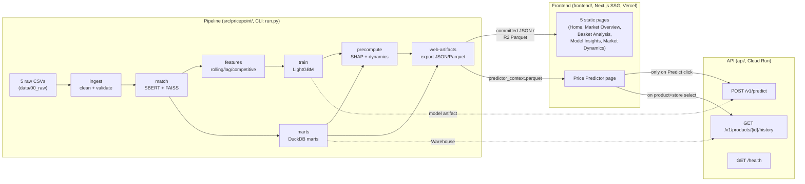

# Architecture

PricePoint Dynamics decodes UK supermarket pricing strategy from
9,529,247 daily price records (791MB raw CSV) across 5 retailers (ASDA,
Aldi, Morrisons, Sainsbury's, Tesco). The system has three layers: a
Python data/ML pipeline, a FastAPI serving layer for the one thing that
can't be precomputed, and a statically-exported Next.js frontend.

See `project_refactor.md` for the full refactor plan and reasoning this
page summarizes, and `docs/adr/` for the individual decisions behind each
major choice below.

## System diagram

## Layer 1: the pipeline (`src/pricepoint/`)

One Python package, one CLI (`run.py`, Typer), orchestrating 5 sequential
stages plus 3 precompute/export steps. Every `run_*` stage function is
idempotent: a `<output>.manifest.json` sidecar (`manifest.py`) records
what produced the current output, and `has_sources_changed()` skips
re-processing if nothing upstream changed (`--force` overrides this).

| Stage | Module | Input → Output |
|---|---|---|
| `ingest` | `data_ingestion.py` | 5 raw CSVs → `cleaned_supermarket_data.parquet` |
| `match` | `product_matching.py` | interim Parquet → `canonical_products_e5.parquet` (Sentence-BERT `intfloat/e5-large` + FAISS bounded-degree mutual-kNN clustering, [ADR-0007](adr/0007-bounded-degree-mutual-k-clustering.md)) |
| `features` | `feature_engineering.py` | canonical Parquet → `feature_engineered_data.parquet` (rolling/lag/competitive/cyclical features, [ADR-0006](adr/0006-no-target-leakage-leave-one-out.md)) |
| `train` | `training.py` | feature Parquet → `models/price_predictor_lgbm.joblib` + `metrics.json` (LightGBM, time-split) |
| `marts` | `marts.py` | canonical Parquet → `data/03_marts/{dim_product,dim_retailer,fact_price_daily}.parquet` (DuckDB, [ADR-0001](adr/0001-duckdb-not-postgres.md)) |
| `precompute` | `market_analysis.py` | marts + model → SHAP matrices, HHI, price leadership/dispersion |
| `web-artifacts` | `web_artifacts.py` | marts + precompute output → the small JSON/Parquet artifacts the frontend reads |

Every pipeline stage now also writes a timestamped JSON run report to
`data/_run_reports/` (rows in/out, null counts, duration, schema hash —
`run_reports.py`) alongside its manifest, per the observability strategy
in `project_refactor.md` §14.

Two Pandera schemas gate correctness: `RAW_DATA_SCHEMA` (post-cleaning)
and `CANONICAL_PRODUCTS_SCHEMA`/`FEATURE_DATA_SCHEMA` (post-matching,
post-feature-engineering). A schema violation raises and propagates to a
non-zero process exit code — a failed scheduled pipeline run surfaces as
a failed GitHub Actions run, no separate alerting tooling needed.

## Layer 2: the API (`api/`)

FastAPI, deliberately narrowed to the genuine minimum
([ADR-0005](adr/0005-static-first-zero-wait-frontend.md)):

- `GET /health` — liveness, also used as a Cloud Run keep-alive target.
- `POST /v1/predict` — the one action that's inherently unbounded
  (arbitrary user-chosen product/store/date/price-override) and cannot
  be precomputed. Builds its feature vector via
  `training.py::build_feature_vector`, sharing the *exact same*
  categorical-encoding/column-selection logic training uses, so a served
  prediction is provably equivalent to a direct `model.predict()` call on
  identically-resolved data, not merely similar.
- `GET /v1/products/{canonical_id}/history` — promoted from a static
  artifact to a live endpoint when the Predictor page needed a real
  historical price chart (see ADR-0005's "promotion" note). Backed by
  `Warehouse.get_product_history` (DuckDB over `fact_price_daily`).

Every other endpoint originally scoped in `project_refactor.md` §8.1 is
replaced by a precomputed static artifact for the dashboard's current
scope — each with a named, concrete promotion trigger, not built
speculatively (§23).

Cross-cutting: CORS restricted to explicit configured origins (never
`*`), `slowapi` in-process rate limiting on `/v1/predict`, and one
exception-hierarchy → HTTP-status mapping (`api/main.py`) so route
handlers never hand-write their own `try/except` → `HTTPException`
translation.

## Layer 3: the frontend (`frontend/`)

Next.js, statically exported (`output: "export"`). 5 of 6 pages are pure
SSG reading committed JSON/Parquet artifacts at build time — no backend
call, no cold start, full stop. Only the Price Predictor page makes live
network calls, and only on explicit user action (never on page load).

| Page | Data source |
|---|---|
| Home, Market Overview, Basket Analysis, Market Dynamics | `frontend/public/data/*.json`, read via `fs` at build time (Server Components) |
| Model Insights | `frontend/public/data-r2/shap_explorer_*.parquet`, parsed client-side (`hyparquet`) |
| Price Predictor | `frontend/public/data-r2/predictor_context.parquet` for search/context (client-side); `POST /v1/predict` + `GET /v1/products/{id}/history` for the live prediction + history chart |

## Data layer

Raw → interim → processed (canonical, feature-engineered) → marts, all
Parquet, all gitignored (regenerated from source, never committed). The
5 raw CSVs are acquired via `scripts/download_raw_data.py` against a
verified Kaggle dataset slug, not manually placed.

## What's deliberately not here

Distributed processing, an orchestrator, PostgreSQL, DVC, and a WAF/SSO
security layer were all considered and rejected — see `docs/adr/` and
`project_refactor.md` §1 for the reasoning behind each.
